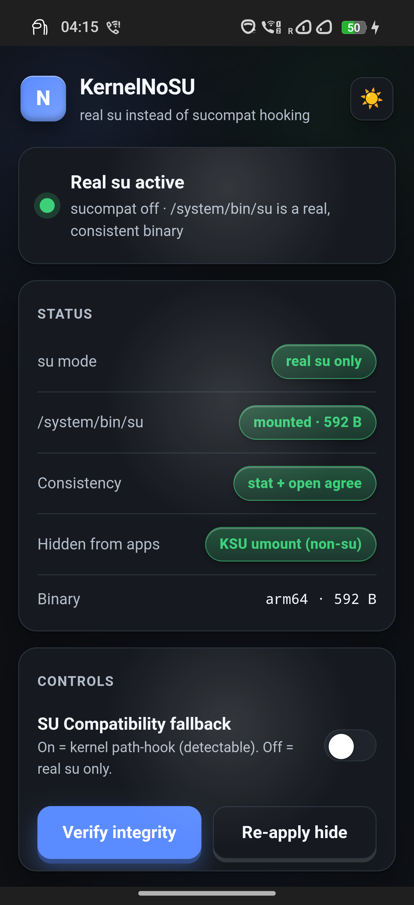

# KernelNoSU

A real `su` binary that replaces KernelSU's built-in **sucompat** path-hooking with a genuine, mount-based su — and hides it from apps.

Sucompat works by hooking the kernel so that running or checking `/system/bin/su` transparently grants root, without any real file on disk. That leaves a tell: `stat()` reports the path present while `open()`/`read()` return `ENOENT` — an inconsistency root detectors look for. KernelNoSU instead mounts a **real** `su` where `stat`, `open` and `exec` all agree, and relies on KernelSU to umount it from non‑su apps' mount namespaces — so root sees a consistent binary and untrusted apps see nothing at all.

## How it works

The trick is *when* things happen during boot:

1. **`post-fs-data.sh`** (or **`late-load.sh`** in LKM late-load) disables sucompat **before** modules are mounted. While sucompat is on it spoofs `/system/bin/su`, and that fake, non‑real dentry blocks the mount backend from binding a real su there.
2. The module tree is magic-mounted — now `/system/bin/su` is our real, tiny (~600 B) static binary.
3. **`post-mount.sh`** runs **`harden.sh`** (stable SELinux context + perms, hide from non‑su apps) → **`verify.sh`** (self-heal, below) → **`set_desc.sh`** (live status badge on the module card).
4. **`boot-completed.sh`** posts a notification of the active mode.

The `su` binary itself just uses KernelSU's supercall: `reboot()` magic to obtain an fd, then `ioctl(GRANT_ROOT)`, then `execve /data/adb/ksud`. The kernel gates the grant via `allowed_for_su()`, so the binary is not the security boundary — only allow-listed UIDs get root.

## Self-healing

Disabling sucompat is **runtime-only** — it never touches `/data/adb/ksu/.feature_config`. So if the real su ever fails to land (mount backend quirk, etc.), `verify.sh` detects it (sha1-compares the mounted su against the module binary) and re-enables sucompat, and even a plain **reboot** restores the on-disk config. Root can't get stuck off. KSU **safe mode** is the ultimate fallback.

## Compatibility

| | |
|---|---|
| **Managers** | KernelSU and forks with the new ioctl supercall (UAPI ≥ 2): tiann KernelSU, KernelSU-Next, SukiSU, ReSukiSU |
| **GKI built-in** | ✅ full |
| **LKM (loaded by init)** | ✅ full |
| **LKM late-load** | ✅ via `late-load.sh` |
| **Not supported** | Magisk (no supercall/ksud); APatch (KernelPatch superkey model, not KernelSU's ioctl supercall); old prctl-only KernelSU |
| **SUSFS** | optional. Pure LKM = stock/unpatched kernel = **no SUSFS**. The core (real su + hide via KSU umount) still works; the wider SUSFS hiding layer needs a patched (custom) kernel. |

## Install

1. Flash the module zip in your root manager and reboot.
2. Open the module's **WebUI** — you should see **"Real su active"** (green): sucompat off, `/system/bin/su` mounted and consistent, hidden from apps.

`su` now resolves to the real binary; a normal app sees no `/system/bin/su` in its mount namespace.

## WebUI

- **Status** — su mode, mount + consistency, hidden-from-apps, binary arch/size.
- **Controls** — SU Compatibility toggle (switch real-su ⇄ sucompat), integrity verifier, re-apply hide.
- **Anti-detection posture** — su hidden, SUSFS features, Zygisk, Play Integrity, self-heal — with a **Harden now** action.
- Live module-card badge, dark/light theme toggle, subtle 3D depth.

## Anti-detection scope

KernelNoSU covers **one** vector well: it removes the sucompat `stat`/`open` inconsistency and hides its own su from untrusted apps. It is **not** a full evasion suite — broad mount/trace hiding needs **SUSFS** (patched kernel), and attestation (`MEETS_STRONG_INTEGRITY`) needs a **Play Integrity** module. The posture card reflects which of those layers are present.

## Module scripts

| Script | Role |
|---|---|
| `customize.sh` | picks the arch binary, pins install to `/system/bin`, checks `su_compat` feature |
| `post-fs-data.sh` | disables sucompat before the mount (normal boot) |
| `late-load.sh` | same, for LKM late-load (runs at the `late-load` stage) |
| `post-mount.sh` | orchestrates harden → verify → set_desc |
| `harden.sh` | stable SELinux context + `0755`, hide from non-su apps |
| `verify.sh` | self-heal: re-enable sucompat if the real su didn't land |
| `set_desc.sh` | live `[su]` / `[Compat]` / `[nosu]` badge on the module card |
| `boot-completed.sh` | notification of the active mode |
| `action.sh` | Termux `pm` wrapper (a real su, unlike sucompat, doesn't relabel the pts) |

## Building

The `su` binaries are built in CI (`.github/workflows/build.yml`, zig + sstrip) — run the **build kernelnosu** workflow (`workflow_dispatch`) and grab the `kernelnosu` artifact, or download a release zip.

## Requires

A KernelSU-family manager with the **new ioctl supercall** (UAPI ≥ 2 — KernelSU [22004](https://github.com/tiann/KernelSU/commit/562a3b9be795c7fc9ffc5802e24afbb07b4ae29a) or newer). Verified working on:

- [KernelSU](https://github.com/tiann/KernelSU) — upstream
- [KernelSU-Next](https://github.com/KernelSU-Next/KernelSU-Next)
- [SukiSU Ultra](https://github.com/ShirkNeko/SukiSU-Ultra)
- [ReSukiSU](https://github.com/ReSukiSU/ReSukiSU)

Any other fork carrying the same supercall (UAPI ≥ 2) should work. Older prctl-only builds do not.

## Credits

- Original `su` binary and concept: **nampud**
- Upstream: [backslashxx/kernelnosu](https://github.com/backslashxx/kernelnosu)
- This fork (post-fs-data + late-load fix, self-heal, SELinux hardening, WebUI, anti-detection posture): **xx, XxxY**
